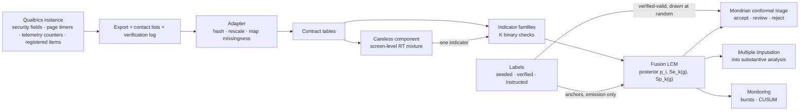

# respondent-validation — Methods by phase

> Companion to the design spec [`specs/respondent-validation.md`](../specs/respondent-validation.md) and its verified reference list [`specs/respondent-validation-references.md`](../specs/respondent-validation-references.md). This document describes the *methods* the spec requires, organized by implementation phase: **(1)** the changes to the Qualtrics instance, **(2)** the preparation of the semi-supervised dataset, and **(3)** the Bayesian fusion and decision methods. The spec remains the authority on what is required. Where this document resolves an ambiguity or adds an operational detail the spec leaves open, it says so in place, and the closing section lists every such point. Requirement locators **(Req n)** refer to the spec. This is not the Req 20 methods note — that is a review with per-claim evidence labels; this is a description of the methods for the people who will instrument the survey, build the dataset, and fit the models.

**Citation policy.** Author–year in the text; the reference list gives every entry with a verification status. Entries carried over from the references file keep that file's status; entries added here were checked against Crossref, the arXiv API, or the publisher's page on 2026-09-26, or are marked otherwise. Platform and vendor documentation is cited for what a platform *does*, never as performance evidence (Req 20). Numbers quoted from studies are those the references file confirmed in the source text unless the entry says they were carried over from a review.

## Contents

- [0. The problem in one page](#0-the-problem-in-one-page)
- [Phase 1 — Changes to the Qualtrics instance](#phase-1--changes-to-the-qualtrics-instance)
- [Phase 2 — Preparing the semi-supervised dataset](#phase-2--preparing-the-semi-supervised-dataset)
- [Phase 3 — Bayesian methods](#phase-3--bayesian-methods)
- [Notes for the spec](#notes-for-the-spec)
- [References](#references)

## 0. The problem in one page

**Setting.** A ~400-respondent pilot of adolescents aged 14–17 with a gender-minority oversample, recruited through open social-media advertisements into a Qualtrics survey with an incentive. Prior waves saw fraud rise despite reCAPTCHA, honeypots, IP screening, and screener cross-checks (spec, summary). On open links, invalid responses are often the *majority*: 94.5% of completed surveys in Pozzar et al. (2020), 61.8% of a first wave in Griffin et al. (2022), 36–39% verified fraud in Pinzón et al. (2024); MacKinnon et al. (2025) kept 957 of 1,377 (69.5%). No study has measured the prevalence of autonomous LLM agents on open social-media links; every figure is panel- or platform-based (Gordon et al., 2026; Chen et al., 2026).

**Threats, kept separate because detection differs by type** (spec, Motivation; prompt §1).

| Threat | Signature | What catches it | What does not |
|---|---|---|---|
| Scripted bots and form-fillers | No pointer events, automation flags, datacenter addresses, bursts | Telemetry and environment flags, burst detection | Anything content-based once a stealth plugin is used |
| Human farms on VPN/VPS or residential proxies | Shared identifiers, templated open-ends, time-zone mismatch, attentive but fast | Identifier graph, near-duplicate text, consistency checks | IP intelligence alone: only 2.2% of 6.2 M residential-proxy addresses appear on any blacklist (Mi et al., 2019); 95% of verified fraud in Pinzón et al. (2024) had US addresses |
| Eligibility fraud (adults as minors; cisgender as gender-minority) | Coherent answers; inconsistency with age-typical facts; clustering in oversampled cells | Identity verification before payment; age-consistency items as weak signals | Every content-based signal; attentive humans pass them (Lambert & Luisi, 2026; MacDonald et al., 2025) |
| Duplicates and ballot-box stuffing | Shared payout handle, identical vectors, consecutive submissions | Graph and hashing; platform duplicate flags | Cookie-based platform controls, which clear with the cookie |
| Mischievous responders | Joint endorsement of low-base-rate items | Registered low-base-rate items, as indicators only | Hurdles and reweighting, which mislabel multiply-marginalized youth (Phillips et al., 2020; Delgado-Ron et al., 2024) |
| Careless / insufficient-effort responding | Fast pages, invariance, inconsistency, onset mid-survey | Careless indices, response-time mixture | Nothing here detects a coherent persona |
| Autonomous LLM agents | Coherent and hypothesis-consistent; simulated timing and typing | Cognitive traps (Affonso, 2026), environment flags, cohort bias tests | Attention checks — passed 99.8% of 6,000 trials (Westwood, 2025); text detectors near chance (Wang et al., 2026) |
| LLM-assisted humans | Paste events, focus loss, homogenized style | Paste and focus counts (41 of 46 LLM-written summaries involved pasting; Veselovsky et al., 2023), homogeneity | Agents that type keystroke-by-keystroke |

**Why fusion rather than rules.** Current practice is rule counts with no error rate: a two-indicator rule excluded 1,408 of 1,977 surveys in Pratt-Chapman et al. (2021); the best ensembles of 31 indicators in Pinzón et al. (2024) reached high recall only with "persistent unacceptable error rates exceeding 5%", where error means valid responses flagged; the ADOPT secondary analysis states it had no ground-truth labels (Oyler et al., 2026). A rule count has no probabilistic output, no error rate, and no way to weight a strong signal against a weak one.

**Core principle (spec).** Every check is an imperfect diagnostic test with unknown, group-specific error rates, and no decision rests on one. The checks are fused by a latent class measurement model in the tradition of diagnostic-test accuracy without a gold standard (Hui & Walter, 1980; Qu, Tan & Kutner, 1996; Dendukuri & Joseph, 2001), whose posterior is the suspicion score. Decisions are made by a distribution-free layer calibrated on *verified*-valid respondents drawn at random, so the false-rejection rate is guaranteed per group without any modeling assumption (Vovk, Gammerman & Shafer, 2005; Vovk, 2012). Classification uncertainty is carried into analysis by multiple imputation (Rubin, 1987), never truncated by deletion. Detection is downstream of design: identity verification before payment and single-use links do the heavy lifting against the one threat no signal detects (Lambert & Luisi, 2026), and the package scores what verification leaves.



---

## Phase 1 — Changes to the Qualtrics instance

The package does not run the study (Req 21), but the model and the guarantee hold only if the survey yields specific data. This phase lists the instance-level changes that make the Req 1 contract satisfiable, in the order a survey builder would make them. Everything here targets the contract; the exact export columns are confirmed against the live instance before the adapter is written — that is the Req 1 **(open)** item, discharged in §1.8.

### 1.1 What the survey must yield

| Contract table (Req 1) | Qualtrics source | Instance change |
|---|---|---|
| `responses` — item values, block, position, reverse keying, category count | Question data; survey structure | Block design with reverse-keyed items in every block and at least two constructs (§1.6) |
| `timing` — first click, last click, page submit, click count per screen | A hidden Timing question on every page | Add one Timing question per page (§1.3) |
| `telemetry` — paste count, focus-loss count, pointer presence, automation flags, script-loaded sentinel | Embedded-data fields written by the survey-side JavaScript | Deploy the telemetry snippet and declare its fields in the Survey Flow (§1.4) |
| `network_device` — hashed address and /24, ASN, proxy class, vendor risk, country, time-zone offset, device hash, user-agent family | Export `IPAddress` column; Meta Info question; time-zone offset from the snippet; vendor lookup at ingestion | Keep IP capture on (do not anonymize); add a Meta Info question (§1.5) |
| `identity` — hashed email local-part, domain, hashed payout handle, disposable-domain flag | Screener contact fields; payout collection | Collect in the screener; hashed by the adapter, never stored in plaintext by the package (§2.2) |
| `open_ends` | Text-entry questions | Retain open-ended items (§1.6) |
| `platform` — reCAPTCHA score and status, duplicate flag | Reserved security fields | Enable Fraud Detection and "Include Security Fields in Responses" (§1.2) |
| `submission` — timestamps, ad set, campaign, stratum, self-reported state, group | Export dates; query-string embedded data; screener items | Pass ad tags through query strings; capture state and gender-minority status in the screener (§1.7) |
| `labels` — anchor label, verification pathway, random-selection flag | Contact-list embedded data and the verification log — not the survey | Seed arms and the verification subset are tracked in contact lists (§1.7, §2.4) |

### 1.2 Platform security fields

Enable Fraud Detection and toggle "Include Security Fields in Responses", which adds the reserved embedded-data fields `Q_RecaptchaScore`, `Q_RecaptchaStatus`, `Q_RecaptchaError`, `Q_BallotBoxStuffing`, and `Q_PrivateBrowserDetected` to every response; enable post-survey Duplicate Detection with the *flag* behaviour, which adds `Q_DuplicateRespondent = true` to each detected duplicate (Qualtrics, n.d.-a). The fields and how the contract treats them:

| Field | What Qualtrics documents | Contract treatment |
|---|---|---|
| `Q_RecaptchaScore` | Google reCAPTCHA v3 score in \[0.0, 1.0\]; Qualtrics reads ≥ 0.5 as "likely human" (Qualtrics, n.d.-a); Google describes 1.0 as "very likely a good interaction" and 0.0 as "very likely a bot" (Google for Developers, 2024). **If the survey terminates immediately or the reCAPTCHA fails to load, the field is set to its default value of 1** and the score "should be disregarded" when the status is "error" (Qualtrics, n.d.-a). | Logged, never thresholded at ingestion (Req 2). The adapter **nulls the score whenever the status is not "complete"** — otherwise a blocked script reads as a confident human, the manufactured false negative the spec warns about (Req 5). The 0.5 reading is a vendor heuristic; the cut is configuration, and the score enters Req 10 as one indicator whose false-positive rate is estimated, not assumed. |
| `Q_RecaptchaStatus` | "complete" or "error" (Qualtrics, n.d.-a) | Mapped to the contract's `recaptcha_status`: "complete" → `ok`; "error" with `Q_RecaptchaError = scriptLoadFailed` → `script_load_failed`; "error" with another reason → `error`; field absent → `missing`. Each non-`ok` value is its own indicator, never a benign default (Req 5). |
| `Q_RecaptchaError` | Reason for an error; the most common is `scriptLoadFailed`, usually an ad blocker, privacy extension or corporate network (Qualtrics, n.d.-a) | Drives the mapping above; ad-blocker use is plausibly correlated with privacy-sensitive respondents, so the indicator carries a group-specific false-positive rate like every other (Req 6, Req 10). |
| `Q_BallotBoxStuffing` | In-survey "Prevent multiple submissions": a cookie is placed on the browser at the first session, and a return on the same browser and device without clearing cookies is flagged; usable in branch logic (Qualtrics, n.d.-a) | Configure to *flag*, not to end the survey. It is a weak duplicate signal — anyone clearing cookies, switching browsers, or using a second device defeats it (Qualtrics, n.d.-f) — and enters the identifier graph (Req 8) as one more shared-identifier edge, not as a hurdle. |
| `Q_DuplicateRespondent` | Post-survey Duplicate Detection; set to `true` only after submission, so it "can't [be used] in branch logic"; it replaces RelevantID, deprecated on June 30, 2025 (Qualtrics, n.d.-a) | The contract's `duplicate_flag` (Req 1(g)). A boolean with no published accuracy; a Req 8 indicator. Never choose the "Do NOT record" option, which deletes the response and with it the evidence. |
| `Q_PrivateBrowserDetected` | Reserved field added with the security fields (Qualtrics, n.d.-a) | Not in the spec's contract. Recommended as an additional `platform` column and Req 5 indicator with a group-specific false-positive rate: private browsing is exactly what a gender-minority adolescent on a shared family device might use, so it must never be a hurdle. Listed under *Notes for the spec*. |

Two facts frame all of this. reCAPTCHA v3 attests a real *browser*, not an eligible human: Westwood's (2025) agent was built around reCAPTCHA-bypass tools. And the Security Scan Monitor (formerly "Email Scan Roadblock") should stay on so that link scanners do not start sessions that the burst detector would otherwise count (Qualtrics, n.d.-f).

Do **not** enable "Anonymize responses": it permanently strips identifying information, including the IP address, from responses collected while it is on (Qualtrics, n.d.-f). Privacy for minors is delivered instead by the adapter, which one-way hashes every identifier with a per-study salt at ingestion and refuses unhashed values (Req 1(e)); retention of the raw export after ingestion is a study data-governance decision, not a package one.

### 1.3 Page timing

Add a hidden Timing question to every page. It records four metrics per page, in seconds: **First Click** (time to the first click), **Last Click** (time to the last click, excluding the next button), **Page Submit** (total time on the page), and **Click Count**; the metrics are additive if the respondent views the page more than once, and an embedded-data field `Q_TotalDuration` tracks whole-survey seconds including time away (Qualtrics, n.d.-b). These are the page-level timers the contract's `timing` table carries (Req 1(b)) and the only response times v1 uses: the careless component works at screen level following Ulitzsch, Shin & Lüdtke (2024); item-level response times through per-question JavaScript are rejected for v1 (Req 9). Design consequence: **a page is the timing unit**, so pages should hold a modest, stable number of items and no page should mix a construct block with unrelated content, or the screen-level mixture in §3.2 loses resolution.

### 1.4 The telemetry snippet contract

Qualtrics lets a question carry JavaScript executed through three page hooks — `addOnload()` when the page loads, `addOnReady()` when it is fully displayed, and `addOnUnload()` when it is left (Qualtrics, n.d.-e) — and the survey engine's JavaScript API can write embedded-data fields (Qualtrics, n.d.-k). The package ships the snippet as documentation and a reference asset (Req 2); its *contract* is what matters here. The snippet writes **counts and booleans only**, into embedded-data fields declared in the Survey Flow before the first block so that an absent value means "the script did not run" rather than "zero":

| Field written | Browser primitive | Meaning |
|---|---|---|
| `paste_count` | `paste` events on text-entry elements (Mozilla Contributors, n.d.-d) | Number of paste events on open-ended items; the most discriminating signal against LLM-assisted humans (Veselovsky et al., 2023) |
| `focus_loss_count` | `visibilitychange` to hidden and window `blur` (Mozilla Contributors, n.d.-e, n.d.-f) | Number of times the survey lost focus — tab switching to a generator |
| `pointer_events_present` | Any `pointerdown` / `pointermove` observed (Mozilla Contributors, n.d.-g) | Whether a pointing device produced events at all; scripted form-fillers often produce none |
| `flag_webdriver` | `navigator.webdriver` (Mozilla Contributors, n.d.-b) | The user agent reports being under automation control — naive Selenium/Playwright |
| `flag_cdp_artifact` | Properties injected into the page by automation frameworks | Present under naive DevTools-protocol automation; absent under stealth plugins |
| `flag_ua_inconsistent` | `navigator.userAgentData` versus the user-agent string and plugin list (Mozilla Contributors, n.d.-c) | Contradictory environment claims |
| `tz_offset_min` | `Date.prototype.getTimezoneOffset()` (Mozilla Contributors, n.d.-a) | Browser-reported offset from UTC, in minutes; Qualtrics does not export one, and it is needed for the time-zone-versus-state consistency indicator (Req 6) |
| `script_loaded` | Set to 1 in the load hook | Sentinel: distinguishes "no paste" from "no script" (Req 1(c)) |

What the snippet must never collect: keystroke streams, inter-key intervals, mouse trajectories, canvas or audio fingerprints. Keystroke dynamics are quasi-biometric and the respondents are minors; the contract's validation refuses raw streams outright, and the "collect then discard" alternative was rejected (Req 1(c)). Environment flags catch naive automation and lose to stealth plugins and real-browser agents — the "perfect discrimination" of Gordon et al.'s (2026) environment check is a pilot result in a preprint — so every flag enters Req 10 as an indicator and none is a block (Req 2).

### 1.5 Device and network fields

The `network_device` table (Req 1(d)) is assembled at ingestion from three sources. The export's `IPAddress` column (Qualtrics, n.d.-i) feeds a vendor lookup for ASN, proxy class, risk score and country; MaxMind's minFraud risk score, which Pinzón et al. (2024) rank among their best indicators, runs from 0.01 to 99 and must be rescaled to the contract's \[0, 1\] (MaxMind, n.d.); no independent sensitivity/specificity evaluation of any IP-intelligence or fingerprinting vendor exists for survey fraud (spec, Motivation). A hidden **Meta Info** question records browser, browser version, operating system and screen resolution (Qualtrics, n.d.-h); together with the time-zone offset from §1.4 these coarse properties are salted and hashed into `device_hash`. The hash is *deliberately coarse*: mobile fingerprints are only 18.5% unique (Gómez-Boix et al., 2018), adolescents on the same phone model collide legitimately, and the spec places any fingerprinting beyond a hashed identifier out of scope. Collisions are therefore consumed only through the inverse-frequency-weighted identifier graph (Req 8), never as a hurdle. The export's `LocationLatitude` / `LocationLongitude` are city- or zip-level values derived from the address (Qualtrics, n.d.-i) and are not used; country and time zone are.

### 1.6 Pre-registered content changes

Two kinds of survey-content change are required. First, **structural** requirements for the careless component (Req 9): reverse-keyed items in every block, and at least two constructs with several items each, so that careless responding can be separated from the trait. Second, the **registry** of pre-registered items, each of which yields one failure indicator (Req 4):

1. **Logically inconsistent pairs** — items that cannot both be true.
2. **Age-consistency items** — school grade, driving, employment — the only content-based signal against adult-as-minor eligibility fraud, and a weak one.
3. **Low-base-rate "mischievous" items** whose joint endorsement is implausible (Robinson-Cimpian, 2014; Cimpian et al., 2018). The hard rule: counts of such endorsements never become a hurdle or a weight. Mischief screening is contested — it risks "conflating sexual and gender minority youth with mischievous responders" (Phillips et al., 2020) — and Cimpian-style reweighting gave a mean weight of 1.01 to youth selecting one racial identity versus 0.40 to those selecting four or more (Delgado-Ron et al., 2024). Each item enters Req 10 with its own group-specific false-positive rate.
4. **Cognitive traps** hard for vision-language architectures, from Affonso's (2026) public repository: traps detected 97.1% of 526 deployed agents at 4.1% human false positives, and two traps reached 93.7% detection at 2.6% false positives for about a minute of survey time. Because model improvement is non-monotonic across the 34 models and 2,040 trials Affonso tested, traps are **refreshed every wave** (Req 18).
5. **Instructed-response attention checks**, retained only as indicators: Westwood's (2025) agent passed 99.8% of 6,000 such trials, and traditional checks caught 2.3% of Affonso's agents.

Open-ended items are retained; they feed the text indicators (Req 7). Item authoring is the study's; the registry schema and failure logic are the package's (Req 4).

### 1.7 Distribution and the design layer

The spec's Req 21 records the protocol the package assumes without running it, and Lambert & Luisi (2026) is its published analogue: staff identity verification within days of the screener, single-use links, re-verification before the incentive, delayed payment — 34,455 clicks became 384 enrolled adolescents at US$101.76 each. The Qualtrics configuration that supports it:

- **Screener on the anonymous link, ad tags in the query string.** Embedded-data fields can be set from URL query-string parameters (Qualtrics, n.d.-c, n.d.-d), which is how `ad_set` and `campaign` reach the `submission` table. Qualtrics warns never to pass personal data in the URL; these tags are not personal.
- **Main survey on personal links.** Personal links "cannot be used more than once" and carry the contact list's embedded data into the response (Qualtrics, n.d.-g); set survey access to "Invitation only" so the anonymous link cannot reach it (Qualtrics, n.d.-f). Stratum and group ride in the contact-list embedded data rather than being re-asked.
- **Seeded arms through the same mechanism.** Scripted bots, LLM persona agents, red-team confederates and the instructed-carelessness arm enter through personal links generated from a *seed* contact list whose embedded data names the arm. The label is therefore unspoofable from the public link and never appears in a URL, and seeded cases exercise the identical instrument, telemetry and reCAPTCHA as organic respondents. This is this document's operational recommendation; the spec only requires that the `labels` table exist (Req 1(i)).
- **Withholding follows a verification attempt.** The incentive is withheld only after a verification attempt, recorded on the `verification_attempted` field of every rejected respondent (Req 14, Req 21).
- **Test and preview responses** carry `DistributionChannel` values of "test" and "preview" (Qualtrics, n.d.-i) and are dropped at ingestion.

What is *not* verification: a re-contact challenge asking respondents to recall an earlier answer. In Pinzón et al. (2024), 82% of confirmed-fraudulent repliers recalled at least one earlier answer correctly — fraud rings keep records — which is why the spec chooses staff identity verification (references file, *Findings*).

### 1.8 The export inventory — discharging the open item

Before the adapter is written, a written inventory of the live export is committed: the respondent-information columns (`ResponseID`, `StartDate`, `EndDate`, `RecordedDate`, `Status`, `Progress`, `Duration`, `Finished`, `IPAddress`, `LocationLatitude`, `LocationLongitude`, `DistributionChannel`, `UserLanguage`, with the exact headers as the live export spells them; Qualtrics, n.d.-i), the five reserved security fields and `Q_DuplicateRespondent`, the four Timing columns per page, the Meta Info columns, and every embedded-data field the snippet and the contact lists write. The adapter's fixture is a real, anonymized export row set. Until that inventory exists the contract above is the target, not a claim about the export (Req 1 **(open)**; spec, Verification).

---

## Phase 2 — Preparing the semi-supervised dataset

### 2.1 What is labeled and what is not

The dataset is *semi-supervised* in a specific sense: most organic respondents are unlabeled, and the labeled minority comes from two different mechanisms with two different roles.

| Label (Req 1(i)) | Origin | Random sample of its class? | Role in the fusion model (Req 10) | Role in conformal calibration (Req 14) | Role elsewhere |
|---|---|---|---|---|---|
| `seeded_bot`, `seeded_agent`, `seeded_redteam` | Study-run seed arms (§2.4) | **No** — chosen threats, not a sample of real fraud | Invalid-class emission with a per-check *seeded offset* | None | Per-threat sensitivity (Req 17); excluded from every substantive output |
| `verified_valid` | Identity/age verification | Yes, when `selected_at_random` is true; otherwise no | Valid-class emission | **Calibration set, only when `selected_at_random` is true** | Detector false-positive measurement (Req 7 **(open)**) |
| `verified_invalid` | Verification failed | Same | Invalid-class emission (no seeded offset) | None | Organic positives for the PU sensitivity analysis (Req 13) |
| `instructed_careless` | Consenting pilot testers answering the second half at random | Not a fraud class at all | **Excluded** — eligible humans responding carelessly by instruction | None | Careless component only (Req 9) |
| Coder adjudication | Blinded two-coder rubric excluding the signals under test, with κ (Cohen, 1960) | — | Enters as **another imperfect test**, not as truth (Req 17(c)) | None | Reported with κ |
| Unlabeled | Everyone else | — | Marginalized over the latent class | Scored | The population the study is about |

Three consequences matter for the rest of the pipeline. A respondent verified *because* they were rejected is a legitimate emission anchor but an inadmissible calibration case, because their selection depended on the score (exchangeability fails; §3.6). Seeded and organic positives are never pooled, in the fusion model (Req 10) or in the PU analysis (Req 13). And "presumed-clean" calibration is rejected outright: at 40–70% prevalence a presumed-valid set is contaminated and the guarantee would be vacuous (Req 14).

### 2.2 From the export to the contract tables

The adapter (Req 2) is the only Qualtrics-specific code. It maps the export plus contact lists and the verification log to the nine long-format tables of Req 1, keyed by an opaque respondent id, and *validates* them. Transformations:

- **Hashing.** Email local-parts are normalized (lower-cased, dots and plus-tags removed) and then hashed; the domain is kept in clear for the disposable-domain check. Full address and its /24 prefix (a configured IPv6 prefix length) are hashed separately; the payout handle is hashed; every hash uses a per-study salt. Validation refuses any unhashed identifier (Req 1(e)).
- **Missingness as categories.** `recaptcha_status` follows the mapping in §1.2, and the score is nulled unless the status is `ok`; telemetry fields default to an explicit *missing* category when `script_loaded` is absent. Missing is never imputed as benign (Req 1, Req 5).
- **Rescaling and recoding.** The vendor risk score is rescaled to \[0, 1\]; `proxy_class` is recoded to {residential, mobile, datacenter, vpn, tor, unknown} with `unknown` for failed lookups; `user_agent_family` is derived from the Meta Info browser and operating-system fields.
- **Timing.** One row per respondent and page from the four Timing metrics, in seconds.
- **Refusals.** Raw keystroke or trajectory columns, unhashed identifiers, and a `verified_valid` label without `selected_at_random` all fail validation (spec, Verification).
- **Hygiene before scoring.** Byte-identical response vectors from the same payout handle are deduplicated; test and preview rows are dropped. This is data hygiene, not classification (Req 8).

### 2.3 From tables to indicators

The fusion model consumes binary indicators $`y_{ik}`$. Each family maps raw tables to a continuous index and then to a binary indicator through a configured threshold or sample-quantile rule; **thresholds are configuration, never constants**, because their false-positive rates are estimated by the fusion model rather than assumed (Req 3). The target is 8–12 heterogeneous indicators from at least four families (Req 11); within-family checks that share evidence (three timing rules, say) are collapsed to one indicator by default — the disjunction is the natural collapse, a count rule is configurable — or given a family-level random effect if the posterior predictive check on within-family concordance fails (Req 10).

**Closed-ended careless and person-fit indices (Req 3).** Computed per block of the `responses` table, with `careless` and `PerFit` as the reference implementations for parity (Yentes & Wilhelm, 2023; Tendeiro, Meijer & Niessen, 2016):

| Index | Definition | Source |
|---|---|---|
| Long-string | Maximum run of identical consecutive values | Meade & Craig (2012) |
| Intra-individual response variability | Within-person standard deviation of responses across a block; both very low (straight-lining) and very high (random) tails are configurable cuts | Dunn et al. (2018) |
| Even–odd consistency | Correlation between even- and odd-item half-scale scores across constructs | Meade & Craig (2012) |
| Psychometric synonyms / antonyms | Within-person correlation over item pairs with strong positive / negative population correlations | Meade & Craig (2012) |
| Mahalanobis $`D^2`$ | $`(r_i-\bar r)^\top S^{-1}(r_i-\bar r)`$ with a robust-covariance option | Meade & Craig (2012) |
| Person fit $`l_z`$, $`l_z^*`$ | Standardized log-likelihood of the response pattern under fitted item parameters; the Snijders correction accounts for the estimated trait | Drasgow, Levine & Williams (1985); Snijders (2001); polytomous standardization, Sinharay (2016) |

A parity caveat recorded by the references file: `PerFit`'s `lzstar` is dichotomous-only and its `lzpoly` extends the original $`l_z`$, so the polytomous $`l_z^*`$ has no R golden file; the parity target must be `lzpoly`, or Sinharay's (2016) standardization must be implemented and validated on simulated data. These indices detect trait-unrelated responding only; Westwood's (2025) agent maintained persona-consistent psychometric profiles, which is why they are indicators, not the score.

**Registered content checks (Req 4).** One indicator per registered item of the five types in §1.6.

**Telemetry and environment (Req 5).** Paste count ≥ 1 on open-ends; focus-loss count above a configured rate; pointer events absent; any automation flag; `recaptcha_status ≠ ok` and score below a configured cut as *separate* indicators; page speed as the ratio of screen time to the per-screen sample median, with the ≤ 30–50%-of-median tiers Pinzón et al. (2024) tested as one configurable indicator.

**Network, device and identity (Req 6).** `proxy_class` in {datacenter, vpn, tor}; vendor risk above a configured cut; country outside the target; time-zone offset inconsistent with the self-reported state; submission hour in a configured window (82.5% of Pozzar et al.'s (2020) screeners arrived between midnight and 4 a.m.); fingerprint-collision degree; an email-pattern score of digits and random strings (Pinzón et al., 2024; "suspicious email" was the most frequently failed flag in MacDonald et al., 2025); disposable domain. Every one is soft. Auto-rejecting VPN, datacenter or foreign addresses is rejected: 76% of Kennedy et al.'s (2020) VPS users failed no quality check, and whether such rules disproportionately flag legitimate gender-minority teens is unmeasured — the pilot measures it (Req 17).

**Open-ended text (Req 7).** (a) Exact and near-duplicate degree: word-shingle sets are summarized by MinHash signatures, whose collision probability estimates Jaccard resemblance (Broder, 1997), bucketed by locality-sensitive hashing so that candidate pairs are found without all-pairs comparison (Indyk & Motwani, 1998); the degree is the number of respondents with estimated resemblance above a configured level, and the buckets also feed the graph. (b) Cross-respondent stylistic homogeneity: embedding cosine to the sample centroid and to nearest neighbours, plus length and lexicon shift, targeting the homogenization of AI-assisted open-ends documented by Zhang, Xu & Alvero (2025). (c) An AI-text detector score — Binoculars (Hans et al., 2024) or Fast-DetectGPT (Bao et al., 2024) — as one **weak** indicator: on RAID, detectors were easily fooled by attacks, sampling changes and unseen models and few operate below 1% false positives (Dugan et al., 2024), and persona-grounded agents push them toward chance (Wang et al., 2026). The detector ships **disabled** until its false-positive rate on verified-valid adolescent open-ends is measured with a Wilson interval (Req 7 **(open)**).

**Cross-respondent structure (Req 8).** A bipartite graph $`G=(R\cup I,E)`$ between respondents and identifiers — hashed /24, ASN, device hash, normalized email local-part, payout handle, text buckets — projected onto respondents with weight

```math
w_{ii'}=\sum_{\iota\ \text{shared by } i,i'} \frac{1}{\mathrm{freq}(\iota)},
```

so that carrier-grade NAT and school Wi-Fi collisions, shared by many, are down-weighted. Per-respondent outputs: connected-component size, community size under the Leiden algorithm (Traag, Waltman & van Eck, 2019), and the maximum number of other respondents sharing any one identifier. Submission bursts: counts per window $`N_w`$ are modeled as Poisson with baseline $`\mu_w`$ tied to ad delivery (impressions × click-through) when available and a rolling median otherwise; $`z_w=(N_w-\mu_w)/\sqrt{\mu_w}`$ above a configured level flags the window and its respondents. Shared identifiers do not imply one person, so every graph feature is an indicator with a group-specific false-positive rate; deterministic removal of shared-address respondents is rejected. A stochastic block model is recorded as an alternative and rejected for v1: at n ≈ 400 with sparse edges components suffice, and the SBM's identifiability assumes fraudsters are far more interconnected than the population, which residential-proxy farms defeat.

**Careless component (Req 9).** The person-level careless share $`\rho_i`$ from the mixture model of §3.2, thresholded at a configured $`\rho^*`$ (default 0.5), is one more indicator.

### 2.4 Anchors: seeding and verification

**Seeded arms (Req 17(a)).** Sizes per the 2026-09-26 decisions: ≥ 40 scripted bots across two stealth levels (with and without stealth plugins); ≥ 40 LLM persona agents across ≥ 3 frameworks and ≥ 2 model families, following Westwood's (2025) persona-plus-memory design; ≥ 30 red-team research-staff confederates under IRB approval, half misrepresenting age and half gender identity; and an instructed-carelessness arm. Seeded cases estimate per-threat sensitivity and never organic prevalence, and are excluded from every substantive output.

**Verification subset (Req 17(b)).** About 150 organic respondents are **randomly selected**, stratified by provisional score tertile and group, oversampling the gender-minority stratum to ≥ 60, for identity and age re-verification; `verification_pathway` records how, and `selected_at_random` is true for them and false for every other verified case. Sensitivity and specificity on this subset are estimated under inverse-probability weights for verification bias (Begg & Greenes, 1983), because the strata are sampled at unequal rates. Random selection is not a nicety: it is the exchangeability that §3.6's guarantee rests on, and it is why the contract fails a `verified_valid` row lacking the flag (Req 21).

**Adjudication (Req 17(c)).** Blinded two-coder adjudication of all organic respondents on a rubric that excludes the signals under evaluation, with agreement reported as κ (Cohen, 1960), entering the fusion model as one more imperfect test rather than as truth.

### 2.5 Covariates, groups and pre-registered exclusions

Prevalence covariates $`x_i`$ — ad set, hour block, oversample stratum, campaign — enter only the prevalence term of the fusion model, never its emission terms (Req 10). The equity group $`g_i`$ is gender-minority status from the screener, the sole calibration stratum; age band and race/ethnicity are monitored, with realized false-rejection rates reported per group, but not separately calibrated, because a ~60-respondent stratum affords a conformal resolution of about 0.016 and nothing finer (Req 14). The variables excluded from every indicator — the study's outcomes — are pre-registered so that classification never depends on the outcome (Req 15), and the exclusion list is enforced at indicator construction.

### 2.6 The analysis-ready object

Phase 2 ends with, for $`n`$ respondents: the indicator matrix $`Y\in\{0,1\}^{n\times K}`$ with missingness already recoded into indicators, the covariates $`x_i`$, groups $`g_i`$, labels $`\ell_i`$ with their selection flags, the continuous indices behind each indicator for reporting, the graph features, and the careless-component share $`\rho_i`$. Every stochastic step upstream — hashing salts aside — is deterministic given the configuration, and every step downstream takes an explicit random key so that seeded runs reproduce bit-identically (Req 19).

---

## Phase 3 — Bayesian methods

Two Bayesian models, one distribution-free decision layer that consumes the first model's posterior, and one propagation step that consumes its draws. All are validated on simulated data with known parameters before any fit to real data (Req 17). Model code is not shown; the reviews the spec was synthesized from contain implementation sketches, and the plans will settle the code.

### 3.1 Notation

| Symbol | Meaning | Domain |
|---|---|---|
| $`i`$, $`n`$ | Respondent; number of respondents | $`i=1,\dots,n`$ |
| $`k`$, $`K`$ | Indicator (check); number of indicators | $`k=1,\dots,K`$, target $`8\le K\le 12`$ |
| $`y_{ik}`$, $`Y`$ | Binary indicator; the indicator matrix | $`\{0,1\}`$ |
| $`g_i`$, $`G`$ | Equity group of $`i`$; number of groups | $`G=2`$ in the pilot |
| $`x_i`$ | Prevalence covariates | $`\mathbb{R}^p`$ |
| $`\ell_i`$ | Anchor label; $`\mathcal{V}_0`$ verified valid, $`\mathcal{V}_1`$ verified invalid, $`\mathcal{S}`$ seeded, $`\mathcal{U}`$ unlabeled | label sets |
| $`C_i`$ | Latent validity class, 1 = invalid | $`\{0,1\}`$ |
| $`\pi(x)`$, $`\alpha_0`$, $`\beta`$ | Prevalence of the invalid class given covariates, and its logistic parameters | $`(0,1)`$; $`\mathbb{R}`$; $`\mathbb{R}^p`$ |
| $`a_k`$, $`\Delta_{gk}`$, $`a_{gk}`$ | Baseline (valid-class) logit of check $`k`$; group deviation; $`a_{gk}=a_k+\Delta_{gk}`$ | $`\mathbb{R}`$ |
| $`\sigma_a`$ | Pooling scale of the group deviations | $`\mathbb{R}_{>0}`$ |
| $`\gamma_k`$ | Class gap of check $`k`$ (monotone) | $`\mathbb{R}_{\ge 0}`$ |
| $`u_i`$ | Shared respondent random effect | $`\mathbb{R}`$, standard normal |
| $`\lambda_{ck}`$ | Class-specific loading of check $`k`$ on $`u_i`$ | $`\mathbb{R}_{\ge 0}`$ |
| $`s_k`$, $`\tau_s`$ | Seeded offset of check $`k`$; its scale | $`\mathbb{R}`$; $`\mathbb{R}_{>0}`$ |
| $`\eta_{ick}`$ | Emission logit of check $`k`$ for $`i`$ in class $`c`$ | $`\mathbb{R}`$ |
| $`\mathrm{Se}_k(g)`$, $`\mathrm{Sp}_k(g)`$ | Sensitivity and specificity of check $`k`$ in group $`g`$ | $`(0,1)`$ |
| $`p_i`$, $`p_i^{(m)}`$ | Posterior probability that $`i`$ is invalid — the suspicion score — and its value at posterior draw $`m`$ | $`(0,1)`$ |
| $`M`$, $`m`$ | Number of posterior draws retained; draw index | — |
| $`j`$, $`J`$; $`s`$, $`S`$ | Item and item count; screen (page) and screen count; $`\mathcal{J}(s)`$ the items on screen $`s`$ | — |
| $`r_{ij}`$, $`R_j`$ | Graded response of $`i`$ to item $`j`$; number of categories | $`\{0,\dots,R_j-1\}`$ |
| $`t_{is}`$ | Log page-submit time of $`i`$ on screen $`s`$ | $`\mathbb{R}`$ |
| $`\theta_i`$ | Trait vector, one component per pre-registered construct | $`\mathbb{R}^{q}`$ |
| $`a_j`$, $`b_{jr}`$ | Item discrimination; ordered category thresholds | $`\mathbb{R}_{>0}`$; increasing in $`r`$ |
| $`\tau_i`$, $`\beta_s`$ | Person speed; screen time-intensity | $`\mathbb{R}`$ |
| $`\sigma_A`$, $`\sigma_C`$, $`\delta`$ | Attentive and careless log-time spreads; careless speed-up | $`\mathbb{R}_{>0}`$; $`\delta>0`$ |
| $`Z_{is}`$, $`\pi_{is}`$ | Careless state of $`i`$ on screen $`s`$; its probability | $`\{0,1\}`$; $`(0,1)`$ |
| $`\eta_i`$, $`\kappa`$, $`\mathrm{pos}_s`$ | Person carelessness intercept; onset slope; normalized screen position | $`\mathbb{R}`$; $`\mathbb{R}`$; $`[0,1]`$ |
| $`\rho_i`$, $`\rho^*`$ | Person-level careless share; its indicator threshold | $`[0,1]`$ |
| $`s_i`$ | Any monotone suspicion score used for triage (default $`\bar p_i`$) | $`\mathbb{R}`$ |
| $`\mathrm{cal}_g`$, $`n_g`$ | Calibration set of group $`g`$; its size | — |
| $`p^{\mathrm{conf}}_i`$, $`\alpha_R`$, $`\alpha_V`$ | Conformal $`p`$-value; reject and review levels | $`(0,1]`$ |
| $`Q`$, $`\hat Q^{(m)}`$, $`U^{(m)}`$ | Substantive estimand; its estimate and variance on completed dataset $`m`$ | — |
| $`\bar p_t`$, $`S_t`$, $`h`$, $`k_c`$ | Hourly mean posterior prevalence of arrivals; CUSUM statistic; alarm threshold; allowance | — |

The careless intercept is written $`\eta_i`$ here, not $`g_i`$ as in the spec, to keep $`g_i`$ for the equity group.

### 3.2 Careless-responding component: a screen-level response-time latent response mixture

**Data-generating story** (Req 9, after Ulitzsch et al., 2022, simplified). Each person–screen pair is either attentive ($`Z_{is}=0`$) or careless ($`Z_{is}=1`$). Attentive responses follow a graded response model (Samejima, 1969) in the trait, and the page's log time follows a normal law centred on the screen's time-intensity less the person's speed; careless responses are uniform over categories and the page is faster by $`\delta>0`$:

```math
P(r_{ij}\ge r\mid\theta_i, Z_{is}=0)=\mathrm{expit}\!\left(a_j\theta_{i,c(j)}-b_{jr}\right),\qquad
t_{is}\mid Z_{is}=0\ \sim\ N\!\left(\beta_s-\tau_i,\ \sigma_A^2\right),
```

```math
P(r_{ij}=r\mid Z_{is}=1)=\frac{1}{R_j},\qquad
t_{is}\mid Z_{is}=1\ \sim\ N\!\left(\beta_s-\tau_i-\delta,\ \sigma_C^2\right),
```

```math
\mathrm{logit}\,\pi_{is}=\eta_i+\kappa\,\mathrm{pos}_s,
```

where $`c(j)`$ maps item $`j`$ to its construct. The likelihood of person $`i`$ marginalizes the screen states:

```math
L_i=\prod_{s=1}^{S}\Big[(1-\pi_{is})\,N(t_{is};\beta_s-\tau_i,\sigma_A^2)\prod_{j\in\mathcal{J}(s)}P(r_{ij}\mid\theta_i,Z_{is}=0)
\;+\;\pi_{is}\,N(t_{is};\beta_s-\tau_i-\delta,\sigma_C^2)\prod_{j\in\mathcal{J}(s)}\tfrac{1}{R_j}\Big].
```

**A resolution of the spec's notation.** Req 9 writes the mixture at item level with item-level times and, in the same requirement, chooses *screen-level* timing on the page timers. Since the v1 timing unit is the page (§1.3), the latent state is defined here per person–screen and all items on a screen share it — the screen-level simplification that page timers support (Ulitzsch, Shin & Lüdtke, 2024). It reduces to the item-level model when every screen holds one item, which is what item-level times through per-question JavaScript (rejected for v1) would restore.

**Estimands.** $`P(Z_{is}=1\mid\text{data})`$ per screen; the person-level share $`\rho_i=S^{-1}\sum_s P(Z_{is}=1\mid\text{data})`$ (an item-weighted variant is a configuration choice); the onset slope $`\kappa`$, with $`\kappa>0`$ the smooth analogue of a changepoint; and trait estimates purified of careless responding. The fusion model receives $`\mathbb{1}\{\rho_i>\rho^*\}`$ and the continuous $`\rho_i`$ is reported.

**Identifiability** (Req 9). Careless responses are unrelated to $`\theta`$ — reverse-keyed items in every block make a uniform response pattern distinguishable from an extreme trait; $`\delta>0`$ orders the two time components and breaks label switching; at least two constructs with several items each separate $`\theta`$ from careless patterns. Screens with very few items are weakly informative about $`Z_{is}`$ from the response side, so design should avoid one-item pages.

**Suggested priors** (configuration, not constants): $`a_j\sim\mathrm{LogNormal}(0,0.5)`$; thresholds as a normal first cut with half-normal positive increments; $`\beta_s\sim N(\bar t,1)`$; $`\tau_i\sim N(0,0.5)`$; $`\theta_i\sim N(0,1)`$ per construct; $`\eta_i\sim N(-2,1.5)`$; $`\kappa\sim N(0,1)`$; $`\delta\sim\mathrm{HalfNormal}(1)`$; $`\sigma_A,\sigma_C\sim\mathrm{HalfNormal}(0.75)`$.

**Blind spot, stated.** An attentive fraudster or an LLM agent is "attentive" under this model. That is why its output is one indicator and not the fraud score. Recorded alternatives: a third mixture component inflating endorsement of the registered low-base-rate items (a mixture version of Cimpian's screener logic yielding a probability rather than a rank), and the discrete changepoint of CODERS (Welz & Alfons, 2023; R `carelessonset`), which carries nonparametric false-positive guarantees, rejected for v1 in favour of $`\kappa`$.

### 3.3 The fusion model: a semi-supervised latent class model with conditional dependence, prevalence covariates and group-specific false-positive rates

**Data-generating story** (Req 10). Each respondent is valid or invalid; invalidity has covariate-dependent prevalence; each check fires with a probability that depends on the class, the respondent's group, and one shared respondent-level random effect that induces dependence among checks within a class:

```math
C_i\sim\mathrm{Bernoulli}\big(\pi(x_i)\big),\qquad \mathrm{logit}\,\pi(x_i)=\alpha_0+x_i^\top\beta,
```

```math
u_i\sim N(0,1),\qquad
\eta_{ick}=a_{g_i k}+c\,\gamma_k+s_k\,\mathbb{1}[\ell_i\in\mathcal{S}]+\lambda_{ck}\,u_i,\qquad
y_{ik}\mid C_i=c,u_i\ \sim\ \mathrm{Bernoulli}\big(\mathrm{expit}(\eta_{ick})\big),
```

with $`\gamma_k\ge 0`$, $`\lambda_{ck}\ge 0`$, $`a_{gk}=a_k+\Delta_{gk}`$, $`\Delta_{gk}\sim N(0,\sigma_a^2)`$, and $`s_k\sim N(0,\tau_s^2)`$.

Each term is a decision. The shared random effect with class-specific loadings is the Qu–Tan–Kutner / Dendukuri–Joseph conditional-dependence device (Qu, Tan & Kutner, 1996; Dendukuri & Joseph, 2001): a bot that fails the timing rule also fails the pointer rule, and ignoring that dependence biases prevalence and accuracy estimates. The monotone gap $`\gamma_k\ge 0`$ says invalid respondents trip every check at least as often as valid ones — the constraint that breaks label switching. The group deviation $`\Delta_{gk}`$ gives each check a **group-specific false-positive rate**, partially pooled: fully separate per-group parameters were rejected because the gender-minority stratum is small, and a single shared baseline was rejected because it defeats the equity estimand. The seeded offset $`s_k`$ lets seeded cases inform the invalid-class emission without asserting that seeded agents are a random sample of real fraud: they inform $`\gamma_k`$ only through a shrinkage prior. Pooling seeded with organic invalid cases was rejected, and so was excluding seeded cases, which would discard the only per-threat sensitivity information.

**Likelihood with anchors.** The latent class is marginalized analytically. Writing $`E_{ic}=\prod_k \mathrm{expit}(\eta_{ick})^{y_{ik}}\big(1-\mathrm{expit}(\eta_{ick})\big)^{1-y_{ik}}`$,

```math
L_i\mid u_i=
\begin{cases}
(1-\pi(x_i))\,E_{i0}+\pi(x_i)\,E_{i1} & \ell_i\in\mathcal{U},\\
E_{i0} & \ell_i\in\mathcal{V}_0,\\
E_{i1} & \ell_i\in\mathcal{V}_1\cup\mathcal{S}\ (\text{with } s_k \text{ active for } \mathcal{S}).
\end{cases}
```

Anchors therefore enter through their emission likelihood **only**: their contribution carries no prevalence factor, so verified and seeded cases inform $`a`$, $`\gamma`$, $`\lambda`$, $`s`$ and never $`\pi(x)`$. Instructed-careless cases are absent from this likelihood altogether.

**Estimands** (Req 10). The per-respondent posterior

```math
p_i=P(C_i=1\mid y_i,x_i)=\frac{\pi(x_i)\,E_{i1}}{(1-\pi(x_i))\,E_{i0}+\pi(x_i)\,E_{i1}},
```

evaluated at each posterior draw of the parameters and of $`u_i`$ — so $`p_i^{(m)}`$ carries both parameter and classification uncertainty; the per-check, per-group accuracies

```math
\mathrm{Se}_k(g)=\mathbb{E}_u\big[\mathrm{expit}(a_{gk}+\gamma_k+\lambda_{1k}u)\big],\qquad
\mathrm{Sp}_k(g)=1-\mathbb{E}_u\big[\mathrm{expit}(a_{gk}+\lambda_{0k}u)\big],
```

with the expectation over $`u\sim N(0,1)`$ taken by quadrature or Monte Carlo per draw; and the prevalence surface $`\pi(x)`$ over ad set, hour and stratum.

### 3.4 Identifiability, priors and label switching

**Counting.** Under conditional independence, a single population identifies a two-class model only when the free cells exceed the parameters, $`2^K-1\ge 2K+1`$, so $`K\ge 3`$ (Req 11). The Hui–Walter route — two populations with different prevalence and *equal* accuracies — cannot be played by ad sets or strata here, because equal accuracy across populations is exactly what the group-specific $`a_{gk}`$ relaxes (Hui & Walter, 1980). The random-effect loadings add parameters again. Hence the target of 8–12 heterogeneous indicators from at least four families **plus anchors**; and, without anchors, informative priors on at least some sensitivities and specificities are mandatory — diffuse priors in Stan latent class models produce near-non-identifiability diagnostics (Cerullo et al., 2022), and the later simulation study reports substantial divergences under a vague default prior (Cerullo et al., 2025).

**Label switching.** Broken by $`\gamma_k\ge 0`$ (Req 11); the general problem and its remedies are surveyed by Jasra, Holmes & Stephens (2005). Two constraints used elsewhere are rejected: $`\pi<0.5`$, because invalid responses are frequently the majority on open links (94.5%, 61.8%, 36–39% in the studies above), so it would truncate the true posterior; and "sensitivity exceeds specificity", which nothing guarantees for a weak indicator. Monotonicity is checked per indicator after fitting: a check whose posterior $`\gamma_k`$ concentrates at zero is dropped or re-signed.

**Priors.** Suggested defaults, recorded as configuration and replaced by the verified sensitivities and specificities of the Req 20 note where they exist:

| Parameter | Default | Rationale |
|---|---|---|
| $`\alpha_0`$ | $`N(0,1.5)`$ | Prevalence may exceed one half on open links; centred at 0.5, wide |
| $`\beta`$ | $`N(0,1)`$ per coefficient | Weakly informative on the logit scale |
| $`a_k`$ | $`N(-2.5,1)`$, or informative from Req 20 | Median baseline false-positive rate ≈ 7.6%, 95% mass ≈ 1–37% |
| $`\Delta_{gk}`$, $`\sigma_a`$ | $`N(0,\sigma_a^2)`$, $`\sigma_a\sim\mathrm{HalfNormal}(1)`$ | Partial pooling; a half-normal is the recommended weakly informative scale prior (Gelman, 2006). With $`G=2`$ the pooling scale is set largely by its prior — acceptable as a regularizer on the gender-minority deviation, and a mandatory sensitivity axis |
| $`\gamma_k`$ | $`\mathrm{HalfNormal}(2.5)`$ | Monotone gap; median ≈ 1.7 logits |
| $`\lambda_{ck}`$ | $`\mathrm{HalfNormal}(0.75)`$ | Dependence loadings |
| $`s_k`$, $`\tau_s`$ | $`N(0,\tau_s^2)`$, $`\tau_s\sim\mathrm{HalfNormal}(1)`$ | Seeded offsets shrink toward the organic invalid emission |

Fixed-effects pairwise covariance terms (Dendukuri & Joseph, 2001) are the recorded alternative for $`K\le 4`$ and rejected as the primary: they grow as $`K^2`$, the cell-count form yields no per-respondent posterior, and $`K=2`$ is unidentified without them. A three-class model (valid / careless / invalid) is fitted and reported beside the two-class default; two classes remain the default because the careless component already separates carelessness (Req 11).

### 3.5 Inference, diagnostics and validation on simulated data

**Inference.** Both models are sampled by Hamiltonian Monte Carlo with adaptive path length — the No-U-Turn Sampler (Hoffman & Gelman, 2014) — over the continuous parameters, which is why the discrete $`C_i`$ and $`Z_{is}`$ are marginalized analytically rather than sampled. The group deviations and random effects are written in non-centred form. Four chains; explicit random keys; seeded runs reproduce bit-identically (Req 19). The house stack is NumPyro on JAX (Phan, Pradhan & Jankowiak, 2019; Bradbury et al., 2018) with ArviZ for diagnostics (Kumar et al., 2019) and Polars for every table (Polars, n.d.); the (open) stack check under the `requires-python` floor is a one-command test (Req 19).

**Diagnostics shipped by one command** (Req 11): rank-normalized $`\hat R`$ and effective sample size (Vehtari et al., 2021); divergent transitions, which signal the posterior geometry HMC cannot traverse (Betancourt, 2017); posterior predictive checks on every pairwise indicator concordance and on within-family concordance, the check that decides whether a family-level random effect is needed; prior-sensitivity tables for $`a_k`$, $`\gamma_k`$ and $`\sigma_a`$; the two- versus three-class comparison; and the per-indicator monotonicity report. These are the workflow steps of Gelman et al. (2020) applied to this model.

**Validation before any real fit** (Req 17; spec, Verification). On simulated data with known parameters at $`n=400`$, $`K=10`$, two groups, with anchors present and again with anchors absent under informative priors, the fusion model must recover $`\pi`$, every $`\mathrm{Se}_k`$ and $`\mathrm{Sp}_k`$, and the group gaps $`\Delta_{gk}`$, with posterior intervals covering the truth at the nominal rate across seeds — the coverage logic of simulation-based calibration (Talts et al., 2018); the careless component must recover $`\kappa`$, $`\delta`$ and the person-level shares with $`\delta>0`$ enforced and no label switching across chains; and the realized conformal false-rejection rate among held-out verified-valid respondents must be at or below $`\alpha_R`$ in every group.

### 3.6 From posterior to decision: Mondrian split-conformal three-band triage

**Why a distribution-free layer on top of a Bayesian posterior.** The posterior $`p_i`$ is only as good as the model. Conformal prediction converts *any* monotone score into a decision with a finite-sample error guarantee that needs only exchangeability — the model may be misspecified and the guarantee for valid respondents still holds; the model's job is ranking power (Vovk, Gammerman & Shafer, 2005; Angelopoulos & Bates, 2023). The split (inductive) form calibrates on a held-out set (Papadopoulos et al., 2002); the Mondrian form calibrates *within categories* and delivers the guarantee per category (Vovk, 2012) — here, per equity group.

**Procedure** (Req 14). Take a monotone suspicion score $`s_i`$, by default the posterior mean $`\bar p_i`$. For each group $`g`$, the calibration set $`\mathrm{cal}_g`$ is the verified-valid respondents of that group drawn at random (§2.4). Then

```math
p^{\mathrm{conf}}_i=\frac{1+\#\{j\in\mathrm{cal}_{g_i}: s_j\ge s_i\}}{n_{g_i}+1};\qquad
\text{reject if } p^{\mathrm{conf}}_i\le\alpha_R,\quad
\text{review if } \alpha_R<p^{\mathrm{conf}}_i\le\alpha_V,\quad
\text{accept otherwise.}
```

**Guarantee.** If a valid test respondent in group $`g`$ is exchangeable with $`\mathrm{cal}_g`$, then $`p^{\mathrm{conf}}_i`$ is super-uniform and $`P(\text{reject}\mid\text{valid},g)\le\alpha_R`$ for every $`g`$ — the per-group false-positive constraint the equity requirement calls for, with no model assumption. It is an equal-opportunity-style constraint on the valid class (Hardt, Price & Srebro, 2016) achieved by group-specific thresholds rather than constrained training. The "$`\ge`$" in the count treats ties conservatively.

**Resolution and defaults.** $`p^{\mathrm{conf}}\ge 1/(n_g+1)`$, so the package refuses an $`\alpha_R`$ below the resolution with an error naming the required $`n_g`$: a 60-respondent group resolves to about 0.016, and $`\alpha_R=0.01`$ needs $`n_g\ge 99`$. Pilot defaults (user decision 2026-09-26): $`\alpha_R=0.05`$, $`\alpha_V=0.20`$, tightening to $`\alpha_R=0.01`$ once pooled per-group calibration across waves reaches 99; recalibrate every wave. The review band is sized to reviewer capacity; $`\alpha_R`$ is set by the cost of wrongly denying a legitimate teen's incentive and data.

**Alternative non-conformity scores.** The PU score of §3.8, or isolation-forest (Liu, Ting & Zhou, 2008) and local-outlier-factor (Breunig et al., 2000) anomaly scores — the latter's only sanctioned role, since as *detectors* they flag any minority subgroup.

**Rejected and recorded.** Rejected: a "presumed nominal" calibration set; score-quantile bands such as auto-rejecting the top 5%; prediction-powered online conformal detection (for v1). Recorded alternative: conformal Benjamini–Hochberg over the $`p`$-values, which controls the false discovery rate among rejections instead of the per-respondent false-rejection rate (Bates et al., 2023; Benjamini & Hochberg, 1995).

**Consequence of a rejection.** The incentive is withheld only after a verification attempt (Req 14, Req 21). A rejected respondent who then verifies as valid becomes a verified-valid anchor for the fusion model — and stays out of the calibration set, because their verification was score-dependent.

### 3.7 Carrying classification uncertainty into substantive analysis

**Default: multiple imputation of class membership** (Req 15). For each of $`M`$ retained posterior draws, sample $`C_i^{(m)}\sim\mathrm{Bernoulli}(p_i^{(m)})`$, fit the substantive model on $`\{i: C_i^{(m)}=0\}`$ to obtain $`\hat Q^{(m)}`$ with variance $`U^{(m)}`$, and combine by Rubin's (1987) rules:

```math
\bar Q=\frac{1}{M}\sum_m \hat Q^{(m)},\qquad
W=\frac{1}{M}\sum_m U^{(m)},\qquad
B=\frac{1}{M-1}\sum_m\big(\hat Q^{(m)}-\bar Q\big)^2,\qquad
T=W+\Big(1+\frac{1}{M}\Big)B.
```

Because $`p_i^{(m)}`$ varies across draws, $`B`$ carries both the classification uncertainty of each respondent and the parameter uncertainty of the fusion model; deletion at a threshold discards both.

**Sensitivity analyses shipped beside it.** Probability weighting by $`1-\bar p_i`$, with a bootstrap over the fusion fit because it understates variance otherwise — the continuous analogue of the reweighting in Cimpian, Timmer & Kim (2023); and trimming bounds that assume invalid prevalence up to the posterior 97.5% quantile and remove the most outcome-favourable or -unfavourable cases (Horowitz & Manski, 1995; Lee, 2009). Bounds matter here because invalid responses are directional: mischief and cisgender-as-gender-minority fraud inflate gender-minority disparities in the same direction (spec, Motivation). The Bolck–Croon–Hagenaars three-step approach (Bolck, Croon & Hagenaars, 2004) is recorded as the alternative for structural-equation users. The package emits the $`M`$ completed datasets, the weights and the bounds; the substantive analysis is the study's.

### 3.8 Complements outside the Bayesian core

**Positive-unlabeled discriminative sensitivity analysis** (Req 13). A gradient-boosted classifier (Friedman, 2001) on all indicators, with out-of-fold scores $`g(x)=P(s=1\mid x)`$ for "labeled invalid" versus everything else, **calibrated out of fold** by isotonic or Platt scaling *before* any correction — uncalibrated boosted scores make the correction meaningless (Zadrozny & Elkan, 2002; Niculescu-Mizil & Caruana, 2005). Under the selected-completely-at-random assumption, $`P(C=1\mid x)=g(x)/c`$ with $`c`$ the mean calibrated score on held-out labeled positives (Elkan & Noto, 2008). That assumption is almost certainly violated — the fraud you caught is the easy fraud — so the labeling propensity $`e(x)`$ is modeled as a function of detection pathway as the selected-at-random variant (Bekker & Davis, 2018, 2020), and seeded cases are never pooled with organically caught fraud when estimating $`c`$. Role: a sensitivity analysis and discriminative complement, never the primary score; below roughly 50 organic labeled positives the fusion model is preferred outright. The reason supervised scoring is demoted: the best published careless-responding classifier reached at most 19% precision against instructed labels (Schroeders, Schmidt & Gnambs, 2022, per Alfons & Welz, 2024).

**Cohort-level agent diagnostics** (Req 12). Agents bias rather than add noise — they infer the hypothesis and confirm it, and their answer distributions lack human idiosyncratic variance (Westwood, 2025). For each Req 8 community and for the high-posterior band, the report tests whether substantive means shift toward hypothesis-consistent or persona-stereotyped values relative to the low-posterior band and reports between-band variance ratios. This is a diagnostic on *groups*, so it never enters the fusion model and leaves every $`p_i`$ unchanged.

**Online monitoring** (Req 16). Hourly, the burst detector of §2.3 and a CUSUM (Page, 1954) on the posterior-mean prevalence of new arrivals under the current fusion fit,

```math
S_t=\max\!\big(0,\ S_{t-1}+\bar p_t-\mu_0-k_c\big),\qquad \text{alarm when } S_t>h,
```

with reference level $`\mu_0`$, allowance $`k_c`$ and threshold $`h`$ as configuration. Alarms carry the triggering statistic and window; the package never pauses the survey — that is study operations. Bayesian online changepoint detection (Adams & MacKay, 2007) is the recorded upgrade. The fixture both detectors must trip immediately is Pozzar et al.'s (2020) 576 screeners in 7 hours.

### 3.9 Evaluation: what the pilot can and cannot certify

**Metrics** (Req 17): per-threat sensitivity with Wilson intervals (Wilson, 1927); specificity and false-rejection rate per group, monitored groups included; AUROC and PR-AUC — essential at a prevalence that swings 30–60% across waves; calibration of $`p_i`$ against the verified subset; the posterior predictive checks of §3.5; the realized conformal false-rejection rate per group; and the change in key disparity estimates under multiple imputation versus listwise deletion versus bounds. Removal rates are never reported as success.

**Precision, stated in advance.** 36 of 40 seeded detections give a sensitivity interval of 0.770–0.960; 3 of 60 group false rejections give 0.017–0.137. The pilot can rank signals and detect gross group disparities, but it cannot certify a group false-rejection rate below about 5% — which is why $`\alpha_R`$ starts at 0.05 and tightens only when pooled calibration across waves reaches 99 per group.

**Drift** (Req 18). Each wave: re-seed agents on current model families, refresh the traps, re-measure the detector's false-positive rate, recalibrate the conformal layer, and track per-signal sensitivity over waves as the drift indicator. Public resources calibrate the text-detector and trap indicators only: RAID (Dugan et al., 2024), Affonso's (2026) trap repository, Gordon et al.'s (2026) OSF data; ASURRE (Wang et al., 2026) is named by its paper but its repository was empty on 2026-09-26. No public labeled dataset of open-link fraud with verified ground truth exists, and none for adolescents.

---

## Notes for the spec

Points this document resolved, added, or found while writing it; each is a candidate amendment, not a change made.

1. **Req 9 — latent unit.** The spec writes the mixture at item level while choosing screen-level timing. §3.2 defines the careless state per person–screen; the spec's notation should say which unit it means.
2. **Req 1(g) / Req 5 — the reCAPTCHA default.** Qualtrics sets `Q_RecaptchaScore` to its *default value of 1* when the survey terminates immediately or the script fails to load (Qualtrics, n.d.-a). The adapter must null the score unless the status is "complete"; otherwise the spec's "missing is never benign" rule is violated silently at the source. Worth stating in the contract.
3. **Req 1(g) — `Q_PrivateBrowserDetected`.** A reserved security field the contract does not carry. Recommended as a `platform` column and a Req 5 indicator with a group-specific false-positive rate (§1.2).
4. **Req 8 — `Q_BallotBoxStuffing`.** Qualtrics's in-survey duplicate control is a browser cookie (Qualtrics, n.d.-a, n.d.-f). It is a weak shared-identifier edge, not a duplicate determination; the spec's `duplicate_flag` should distinguish it from the post-survey `Q_DuplicateRespondent`.
5. **Req 1(d) — time-zone offset.** Qualtrics does not export one; `tz_offset_min` must come from the telemetry snippet (§1.4), so it belongs in the Req 2 snippet contract.
6. **Req 21 / Req 17 — seeded arms.** Running seed arms through personal links generated from a seed contact list, with the arm in contact-list embedded data, keeps the label out of any URL and unspoofable (§1.7). The spec could name this as the reference mechanism.
7. **Req 14 — score-dependent verification.** A rejected respondent who verifies as valid is an emission anchor but not a calibration case (§2.1, §3.6). The `labels` table already carries `selected_at_random`; the spec could state this consequence explicitly.
8. **Req 3 / Verification — polytomous $`l_z^*`$.** Carried over from the references file: `PerFit` has no polytomous $`l_z^*`$ golden file; the parity bullet should target `lzpoly` or name Sinharay (2016) as the reference.
9. **Req 17 — ASURRE.** Carried over: not yet public as of 2026-09-26.

## References

Status tags: **[refs: Verified]**, **[refs: Partial]**, **[refs: Corrected]** — carried from the references file with its status; **[Verified here]** — checked on 2026-09-26 against Crossref, the arXiv API, or the publisher's or vendor's page, with any field that could not be confirmed named; **[Partial here]**, **[Unverified]** likewise.

Adams, R. P., & MacKay, D. J. C. (2007). *Bayesian online changepoint detection* [Preprint]. arXiv. https://doi.org/10.48550/arXiv.0710.3742 **[refs: Verified]**

Affonso, F. M. (2026). Brief commentary: A framework for detecting AI agents in online research. *Journal of Consumer Research*, *53*(3), 619–633. https://doi.org/10.1093/jcr/ucag006 **[refs: Verified]**

Alfons, A., & Welz, M. (2024). Open science perspectives on machine learning for the identification of careless responding: A new hope or phantom menace? *Social and Personality Psychology Compass*, *18*(2), Article e12941. https://doi.org/10.1111/spc3.12941 **[refs: Verified]**

Angelopoulos, A. N., & Bates, S. (2023). Conformal prediction: A gentle introduction. *Foundations and Trends in Machine Learning*, *16*(4), 494–591. https://doi.org/10.1561/2200000101 **[Verified here — Crossref]**

Bao, G., Zhao, Y., Teng, Z., Yang, L., & Zhang, Y. (2024). Fast-DetectGPT: Efficient zero-shot detection of machine-generated text via conditional probability curvature. In *International Conference on Learning Representations (ICLR 2024)*. https://openreview.net/forum?id=Bpcgcr8E8Z **[refs: Partial — venue confirmed, OpenReview page not fetched]**

Bates, S., Candès, E., Lei, L., Romano, Y., & Sesia, M. (2023). Testing for outliers with conformal *p*-values. *The Annals of Statistics*, *51*(1), 149–178. https://doi.org/10.1214/22-AOS2244 **[refs: Verified]**

Begg, C. B., & Greenes, R. A. (1983). Assessment of diagnostic tests when disease verification is subject to selection bias. *Biometrics*, *39*(1), 207–215. https://doi.org/10.2307/2530820 **[refs: Verified]**

Bekker, J., & Davis, J. (2018). Learning from positive and unlabeled data under the selected at random assumption. *Proceedings of Machine Learning Research*, *94*, 8–22. https://proceedings.mlr.press/v94/bekker18a.html **[refs: Verified]**

Bekker, J., & Davis, J. (2020). Learning from positive and unlabeled data: A survey. *Machine Learning*, *109*(4), 719–760. https://doi.org/10.1007/s10994-020-05877-5 **[refs: Verified]**

Benjamini, Y., & Hochberg, Y. (1995). Controlling the false discovery rate: A practical and powerful approach to multiple testing. *Journal of the Royal Statistical Society: Series B (Methodological)*, *57*(1), 289–300. https://doi.org/10.1111/j.2517-6161.1995.tb02031.x **[Verified here — Crossref]**

Betancourt, M. (2017). *A conceptual introduction to Hamiltonian Monte Carlo* [Preprint]. arXiv. https://doi.org/10.48550/arXiv.1701.02434 **[Verified here — arXiv API]**

Bolck, A., Croon, M., & Hagenaars, J. (2004). Estimating latent structure models with categorical variables: One-step versus three-step estimators. *Political Analysis*, *12*(1), 3–27. https://doi.org/10.1093/pan/mph001 **[refs: Verified]**

Bradbury, J., Frostig, R., Hawkins, P., Johnson, M. J., Katariya, Y., Leary, C., Maclaurin, D., Necula, G., Paszke, A., VanderPlas, J., Wanderman-Milne, S., & Zhang, Q. (2018). *JAX: Composable transformations of Python+NumPy programs* [Computer software]. https://github.com/jax-ml/jax **[Verified here — author list and title from the repository's `CITATION.bib`]**

Breunig, M. M., Kriegel, H.-P., Ng, R. T., & Sander, J. (2000). LOF: Identifying density-based local outliers. In *Proceedings of the 2000 ACM SIGMOD International Conference on Management of Data* (pp. 93–104). ACM. https://doi.org/10.1145/342009.335388 **[Verified here — Crossref; the record carries the short title "LOF"]**

Broder, A. Z. (1997). On the resemblance and containment of documents. In *Proceedings. Compression and Complexity of SEQUENCES 1997* (pp. 21–29). IEEE. https://doi.org/10.1109/SEQUEN.1997.666900 **[Verified here — Crossref; year from the proceedings title]**

Cerullo, E., Jones, H. E., Carter, O., Quinn, T. J., Cooper, N. J., & Sutton, A. J. (2022). Meta-analysis of dichotomous and ordinal tests with an imperfect gold standard. *Research Synthesis Methods*, *13*(5), 595–611. https://doi.org/10.1002/jrsm.1567 **[refs: Verified]**

Cerullo, E., Pinkney, S., Sutton, A. J., Lucas, T., Cooper, N. J., & Jones, H. E. (2025). *Latent class multivariate probit and latent trait models for evaluating test accuracy without a gold standard: A simulation study* [Preprint]. arXiv. https://doi.org/10.48550/arXiv.2509.18489 **[refs: Verified — unpublished as of 2026-09-26]**

Chen, S., Urminsky, O., Zhang, G., Walatka, R., Fernandez, K., Low, A., Bogard, J., & Fox, C. R. (2026). *Estimating the threat of AI-agent responding across online survey platforms* [Preprint]. PsyArXiv. https://doi.org/10.31234/osf.io/xcg26_v1 **[refs: Verified]**

Cimpian, J. R., Timmer, J. D., Birkett, M. A., Marro, R. L., Turner, B. C., & Phillips, G. L. (2018). Bias from potentially mischievous responders on large-scale estimates of lesbian, gay, bisexual, or questioning (LGBQ)–heterosexual youth health disparities. *American Journal of Public Health*, *108*(S4), S258–S265. https://doi.org/10.2105/AJPH.2018.304407 **[refs: Verified]**

Cimpian, J. R., Timmer, J. D., & Kim, T. H. (2023). Mitigating invalid and mischievous survey responses: A registered report examining risk disparities between heterosexual and lesbian, gay, bisexual, or questioning youth. *Child Development*, *94*(5), 1136–1161. https://doi.org/10.1111/cdev.13957 **[refs: Verified]**

Cohen, J. (1960). A coefficient of agreement for nominal scales. *Educational and Psychological Measurement*, *20*(1), 37–46. https://doi.org/10.1177/001316446002000104 **[Verified here — Crossref]**

Delgado-Ron, J. A., Jeyabalan, T., Watt, S., & Salway, T. (2024). Mitigating invalid data bias in the estimation of sexual orientation disparities in a survey of youth in US and Canada. *Child Development*, *95*(5), e373–e376. https://doi.org/10.1111/cdev.14111 **[refs: Verified]**

Dendukuri, N., & Joseph, L. (2001). Bayesian approaches to modeling the conditional dependence between multiple diagnostic tests. *Biometrics*, *57*(1), 158–167. https://doi.org/10.1111/j.0006-341X.2001.00158.x **[refs: Verified]**

Drasgow, F., Levine, M. V., & Williams, E. A. (1985). Appropriateness measurement with polychotomous item response models and standardized indices. *British Journal of Mathematical and Statistical Psychology*, *38*(1), 67–86. https://doi.org/10.1111/j.2044-8317.1985.tb00817.x **[Verified here — Crossref]**

Dugan, L., Hwang, A., Trhlík, F., Zhu, A., Ludan, J. M., Xu, H., Ippolito, D., & Callison-Burch, C. (2024). RAID: A shared benchmark for robust evaluation of machine-generated text detectors. In *Proceedings of the 62nd Annual Meeting of the Association for Computational Linguistics (Volume 1: Long Papers)* (pp. 12463–12492). Association for Computational Linguistics. https://doi.org/10.18653/v1/2024.acl-long.674 **[refs: Verified]**

Dunn, A. M., Heggestad, E. D., Shanock, L. R., & Theilgard, N. (2018). Intra-individual response variability as an indicator of insufficient effort responding: Comparison to other indicators and relationships with individual differences. *Journal of Business and Psychology*, *33*(1), 105–121. https://doi.org/10.1007/s10869-016-9479-0 **[Verified here — Crossref]**

Elkan, C., & Noto, K. (2008). Learning classifiers from only positive and unlabeled data. In *Proceedings of the 14th ACM SIGKDD International Conference on Knowledge Discovery and Data Mining* (pp. 213–220). ACM. https://doi.org/10.1145/1401890.1401920 **[refs: Verified]**

Friedman, J. H. (2001). Greedy function approximation: A gradient boosting machine. *The Annals of Statistics*, *29*(5), 1189–1232. https://doi.org/10.1214/aos/1013203451 **[Verified here — Crossref; pages from the journal's page]**

Gelman, A. (2006). Prior distributions for variance parameters in hierarchical models (comment on article by Browne and Draper). *Bayesian Analysis*, *1*(3), 515–534. https://doi.org/10.1214/06-BA117A **[Verified here — Crossref; pages from the journal's page]**

Gelman, A., Vehtari, A., Simpson, D., Margossian, C. C., Carpenter, B., Yao, Y., Kennedy, L., Gabry, J., Bürkner, P.-C., & Modrák, M. (2020). *Bayesian workflow* [Preprint]. arXiv. https://doi.org/10.48550/arXiv.2011.01808 **[Verified here — arXiv API]**

Gómez-Boix, A., Laperdrix, P., & Baudry, B. (2018). Hiding in the crowd: An analysis of the effectiveness of browser fingerprinting at large scale. In *Proceedings of the 2018 World Wide Web Conference (WWW '18)* (pp. 309–318). ACM Press. https://doi.org/10.1145/3178876.3186097 **[refs: Verified]**

Google for Developers. (2024, July 10). *reCAPTCHA v3*. https://developers.google.com/recaptcha/docs/v3 **[refs: Verified]**

Gordon, A., Rothschild, D., Affonso, F. M., Sulik, J., Hauser, D., Pepin, K., & Jones, S. (2026). *AI agent prevalence and data quality across multiple online sample providers* [Preprint]. PsyArXiv. https://doi.org/10.31234/osf.io/pvdjr_v2 **[refs: Verified]**

Griffin, M., Martino, R. J., LoSchiavo, C., Comer-Carruthers, C., Krause, K. D., Stults, C. B., & Halkitis, P. N. (2022). Ensuring survey research data integrity in the era of internet bots. *Quality & Quantity*, *56*(4), 2841–2852. https://doi.org/10.1007/s11135-021-01252-1 **[refs: Verified]**

Hans, A., Schwarzschild, A., Cherepanova, V., Kazemi, H., Saha, A., Goldblum, M., Geiping, J., & Goldstein, T. (2024). Spotting LLMs with Binoculars: Zero-shot detection of machine-generated text. *Proceedings of Machine Learning Research*, *235*, 17519–17537. https://proceedings.mlr.press/v235/hans24a.html **[refs: Verified]**

Hardt, M., Price, E., & Srebro, N. (2016). Equality of opportunity in supervised learning. In *Advances in Neural Information Processing Systems 29*. Preprint: https://doi.org/10.48550/arXiv.1610.02413 **[Partial here — arXiv record verified; the proceedings page did not resolve for automated fetch, so the venue is not re-checked]**

Hoffman, M. D., & Gelman, A. (2014). The No-U-Turn Sampler: Adaptively setting path lengths in Hamiltonian Monte Carlo. *Journal of Machine Learning Research*, *15*(47), 1593–1623. https://jmlr.org/papers/v15/hoffman14a.html **[Verified here — journal page]**

Horowitz, J. L., & Manski, C. F. (1995). Identification and robustness with contaminated and corrupted data. *Econometrica*, *63*(2), 281–302. https://doi.org/10.2307/2951627 **[Verified here — Crossref; the record carries only the first page, 281]**

Hui, S. L., & Walter, S. D. (1980). Estimating the error rates of diagnostic tests. *Biometrics*, *36*(1), 167–171. https://doi.org/10.2307/2530508 **[refs: Verified]**

Indyk, P., & Motwani, R. (1998). Approximate nearest neighbors: Towards removing the curse of dimensionality. In *Proceedings of the Thirtieth Annual ACM Symposium on Theory of Computing (STOC '98)* (pp. 604–613). ACM. https://doi.org/10.1145/276698.276876 **[Verified here — Crossref; the record carries the short title]**

Jasra, A., Holmes, C. C., & Stephens, D. A. (2005). Markov chain Monte Carlo methods and the label switching problem in Bayesian mixture modeling. *Statistical Science*, *20*(1), 50–67. https://doi.org/10.1214/088342305000000016 **[Verified here — Crossref; pages from the journal's page]**

Kennedy, R., Clifford, S., Burleigh, T., Waggoner, P. D., Jewell, R., & Winter, N. J. G. (2020). The shape of and solutions to the MTurk quality crisis. *Political Science Research and Methods*, *8*(4), 614–629. https://doi.org/10.1017/psrm.2020.6 **[refs: Verified]**

Kumar, R., Carroll, C., Hartikainen, A., & Martin, O. (2019). ArviZ a unified library for exploratory analysis of Bayesian models in Python. *Journal of Open Source Software*, *4*(33), 1143. https://doi.org/10.21105/joss.01143 **[Verified here — Crossref]**

Lambert, D., & Luisi, N. (2026). The feasibility and cost-effectiveness of tailored social media advertising to recruit sexual and gender minority adolescents in the Southern United States: Online survey study. *JMIR Formative Research*, *10*, Article e95006. https://doi.org/10.2196/95006 **[refs: Verified]**

Lee, D. S. (2009). Training, wages, and sample selection: Estimating sharp bounds on treatment effects. *The Review of Economic Studies*, *76*(3), 1071–1102. https://doi.org/10.1111/j.1467-937X.2009.00536.x **[Verified here — Crossref]**

Liu, F. T., Ting, K. M., & Zhou, Z.-H. (2008). Isolation forest. In *2008 Eighth IEEE International Conference on Data Mining* (pp. 413–422). IEEE. https://doi.org/10.1109/ICDM.2008.17 **[Verified here — Crossref]**

MacDonald, K. V., Nguyen, G. C., Sewitch, M. J., & Marshall, D. A. (2025). Identifying and managing fraudulent respondents in online stated preferences surveys: A case example from best–worst scaling in health preferences research. *The Patient – Patient-Centered Outcomes Research*, *18*(4), 373–390. https://doi.org/10.1007/s40271-025-00740-y **[refs: Verified]**

MacKinnon, K. R., Khan, N., Newman, K. M., Gould, W. A., Marshall, G., Salway, T., Pullen Sansfaçon, A., Kia, H., & Lam, J. S. H. (2025). Introducing novel methods to identify fraudulent responses (Sampling With Sisyphus): Web-based LGBTQ2S+ mixed-methods study. *Journal of Medical Internet Research*, *27*, Article e63252. https://doi.org/10.2196/63252 **[refs: Verified]**

MaxMind. (n.d.). *Overall risk score*. MaxMind Knowledge Base. Retrieved September 26, 2026, from https://support.maxmind.com/knowledge-base/articles/overall-risk-score-minfraud-maxmind **[refs: Verified]**

Meade, A. W., & Craig, S. B. (2012). Identifying careless responses in survey data. *Psychological Methods*, *17*(3), 437–455. https://doi.org/10.1037/a0028085 **[Verified here — Crossref]**

Mi, X., Feng, X., Liao, X., Liu, B., Wang, X., Qian, F., Li, Z., Alrwais, S., Sun, L., & Liu, Y. (2019). Resident Evil: Understanding residential IP proxy as a dark service. In *2019 IEEE Symposium on Security and Privacy (SP)* (pp. 1185–1201). IEEE. https://doi.org/10.1109/SP.2019.00011 **[refs: Verified]**

Mozilla Contributors. (n.d.-a). *Date.prototype.getTimezoneOffset()*. MDN Web Docs. Retrieved September 26, 2026, from https://developer.mozilla.org/en-US/docs/Web/JavaScript/Reference/Global_Objects/Date/getTimezoneOffset **[Verified here — page fetched]**

Mozilla Contributors. (n.d.-b). *Navigator: webdriver property*. MDN Web Docs. Retrieved September 26, 2026, from https://developer.mozilla.org/en-US/docs/Web/API/Navigator/webdriver **[Verified here — page fetched]**

Mozilla Contributors. (n.d.-c). *Navigator: userAgentData property*. MDN Web Docs. Retrieved September 26, 2026, from https://developer.mozilla.org/en-US/docs/Web/API/Navigator/userAgentData **[Verified here — page fetched]**

Mozilla Contributors. (n.d.-d). *Element: paste event*. MDN Web Docs. Retrieved September 26, 2026, from https://developer.mozilla.org/en-US/docs/Web/API/Element/paste_event **[Verified here — page fetched]**

Mozilla Contributors. (n.d.-e). *Document: visibilitychange event*. MDN Web Docs. Retrieved September 26, 2026, from https://developer.mozilla.org/en-US/docs/Web/API/Document/visibilitychange_event **[Verified here — page fetched]**

Mozilla Contributors. (n.d.-f). *Window: blur event*. MDN Web Docs. Retrieved September 26, 2026, from https://developer.mozilla.org/en-US/docs/Web/API/Window/blur_event **[Verified here — page fetched]**

Mozilla Contributors. (n.d.-g). *Pointer events*. MDN Web Docs. Retrieved September 26, 2026, from https://developer.mozilla.org/en-US/docs/Web/API/Pointer_events **[Verified here — page fetched]**

Niculescu-Mizil, A., & Caruana, R. (2005). Predicting good probabilities with supervised learning. In *Proceedings of the 22nd International Conference on Machine Learning (ICML '05)* (pp. 625–632). ACM. https://doi.org/10.1145/1102351.1102430 **[Verified here — Crossref]**

Oyler, D. R., Edgecombe, S. J., Babusci, E. A., Dolly Prothro, J., Begley, A. L., & Rojas-Ramirez, M. V. (2026). Practical fraud detection and prevention in incentivized online surveys: Secondary analysis of the ADOPT study. *Journal of Medical Internet Research*, *28*, Article e90159. https://doi.org/10.2196/90159 **[refs: Verified]**

Page, E. S. (1954). Continuous inspection schemes. *Biometrika*, *41*(1–2), 100–115. https://doi.org/10.1093/biomet/41.1-2.100 **[Verified here — Crossref]**

Papadopoulos, H., Proedrou, K., Vovk, V., & Gammerman, A. (2002). Inductive confidence machines for regression. In *Machine Learning: ECML 2002* (Lecture Notes in Computer Science, pp. 345–356). Springer. https://doi.org/10.1007/3-540-36755-1_29 **[Verified here — Crossref; the record names the series, not the volume title]**

Phan, D., Pradhan, N., & Jankowiak, M. (2019). *Composable effects for flexible and accelerated probabilistic programming in NumPyro* [Preprint]. arXiv. https://doi.org/10.48550/arXiv.1912.11554 **[Verified here — arXiv API]**

Phillips, G., Felt, D., Fish, J. N., Ruprecht, M. M., Birkett, M., & Poteat, V. P. (2020). A response to Cimpian and Timmer (2020): Limitations and misrepresentation of "mischievous responders" in LGBT+ health research. *Archives of Sexual Behavior*, *49*(5), 1409–1414. https://doi.org/10.1007/s10508-020-01746-3 **[refs: Verified]**

Pinzón, N., Koundinya, V., Galt, R. E., Dowling, W. O'R., Baukloh, M., Taku-Forchu, N. C., Schohr, T., Roche, L. M., Ikendi, S., Cooper, M., Parker, L. E., & Pathak, T. B. (2024). AI-powered fraud and the erosion of online survey integrity: An analysis of 31 fraud detection strategies. *Frontiers in Research Metrics and Analytics*, *9*, Article 1432774. https://doi.org/10.3389/frma.2024.1432774 **[refs: Verified]**

Polars. (n.d.). *Polars: DataFrames for the new era* [Computer software]. Retrieved September 26, 2026, from https://pola.rs/ **[Verified here — site fetched; title is the site's own tagline]**

Pozzar, R., Hammer, M. J., Underhill-Blazey, M., Wright, A. A., Tulsky, J. A., Hong, F., Gundersen, D. A., & Berry, D. L. (2020). Threats of bots and other bad actors to data quality following research participant recruitment through social media: Cross-sectional questionnaire. *Journal of Medical Internet Research*, *22*(10), Article e23021. https://doi.org/10.2196/23021 **[refs: Verified]**

Pratt-Chapman, M., Moses, J., & Arem, H. (2021). Strategies for the identification and prevention of survey fraud: Data analysis of a web-based survey. *JMIR Cancer*, *7*(3), Article e30730. https://doi.org/10.2196/30730 **[refs: Verified]**

Qu, Y., Tan, M., & Kutner, M. H. (1996). Random effects models in latent class analysis for evaluating accuracy of diagnostic tests. *Biometrics*, *52*(3), 797–810. https://doi.org/10.2307/2533043 **[refs: Verified]**

Qualtrics. (n.d.-a). *Fraud detection*. Qualtrics Support. Retrieved September 26, 2026, from https://www.qualtrics.com/support/survey-platform/survey-module/survey-checker/fraud-detection/ **[Verified here — page fetched; the reserved fields, the default score of 1, the status and error values, the cookie mechanism, the branch-logic limitation and the June 30, 2025 deprecation were read on the page]**

Qualtrics. (n.d.-b). *Timing question*. Qualtrics Support. Retrieved September 26, 2026, from https://www.qualtrics.com/support/survey-platform/survey-module/editing-questions/question-types-guide/advanced/timing/ **[Verified here — page fetched; the four metrics, their additivity and `Q_TotalDuration` were read on the page]**

Qualtrics. (n.d.-c). *Embedded data*. Qualtrics Support. Retrieved September 26, 2026, from https://www.qualtrics.com/support/survey-platform/survey-module/survey-flow/standard-elements/embedded-data/ **[Verified here — page fetched]**

Qualtrics. (n.d.-d). *Passing information via query strings*. Qualtrics Support. Retrieved September 26, 2026, from https://www.qualtrics.com/support/survey-platform/survey-module/survey-flow/standard-elements/passing-information-through-query-strings/ **[Verified here — page fetched]**

Qualtrics. (n.d.-e). *Add JavaScript*. Qualtrics Support. Retrieved September 26, 2026, from https://www.qualtrics.com/support/survey-platform/survey-module/question-options/add-javascript/ **[Verified here — page fetched; the three page hooks were read on the page]**

Qualtrics. (n.d.-f). *Security survey options*. Qualtrics Support. Retrieved September 26, 2026, from https://www.qualtrics.com/support/survey-platform/survey-module/survey-options/survey-protection/ **[Verified here — page fetched; Prevent Multiple Submissions, Bot Detection, Security Scan Monitor, Anonymize Responses and Survey Access were read on the page]**

Qualtrics. (n.d.-g). *Personal links*. Qualtrics Support. Retrieved September 26, 2026, from https://www.qualtrics.com/support/survey-platform/distributions-module/email-distribution/personal-links/ **[Verified here — page fetched]**

Qualtrics. (n.d.-h). *Meta info question*. Qualtrics Support. Retrieved September 26, 2026, from https://www.qualtrics.com/support/survey-platform/survey-module/editing-questions/question-types-guide/advanced/meta-info-question/ **[Verified here — page fetched]**

Qualtrics. (n.d.-i). *Understanding your dataset*. Qualtrics Support. Retrieved September 26, 2026, from https://www.qualtrics.com/support/survey-platform/data-and-analysis-module/data/download-data/understanding-your-dataset/ **[Verified here — page fetched]**

Qualtrics. (n.d.-j). *Anonymous link*. Qualtrics Support. Retrieved September 26, 2026, from https://www.qualtrics.com/support/survey-platform/distributions-module/web-distribution/anonymous-link/ **[Verified here — page fetched]**

Qualtrics. (n.d.-k). *Qualtrics JavaScript question API class*. Qualtrics API Reference. https://api.qualtrics.com/82bd4d5c331f1-qualtrics-java-script-question-api-class **[Unverified — linked from the Add JavaScript support page; did not render for automated fetch]**

Robinson-Cimpian, J. P. (2014). Inaccurate estimation of disparities due to mischievous responders: Several suggestions to assess conclusions. *Educational Researcher*, *43*(4), 171–185. https://doi.org/10.3102/0013189X14534297 **[refs: Verified]**

Rubin, D. B. (1987). *Multiple imputation for nonresponse in surveys*. Wiley. https://doi.org/10.1002/9780470316696 **[refs: Verified]**

Samejima, F. (1969). Estimation of latent ability using a response pattern of graded scores. *Psychometrika*, *34*(S1), 1–97. https://doi.org/10.1007/BF03372160 **[Verified here — Crossref; the supplement is Psychometrika Monograph No. 17, a designation not carried in the record]**

Schroeders, U., Schmidt, C., & Gnambs, T. (2022). Detecting careless responding in survey data using stochastic gradient boosting. *Educational and Psychological Measurement*, *82*(1), 29–56. https://doi.org/10.1177/00131644211004708 **[refs: Verified]**

Sinharay, S. (2016). Asymptotically correct standardization of person-fit statistics beyond dichotomous items. *Psychometrika*, *81*(4), 992–1013. https://doi.org/10.1007/s11336-015-9465-x **[Verified here — Crossref]**

Snijders, T. A. B. (2001). Asymptotic null distribution of person fit statistics with estimated person parameter. *Psychometrika*, *66*(3), 331–342. https://doi.org/10.1007/BF02294437 **[refs: Verified]**

Talts, S., Betancourt, M., Simpson, D., Vehtari, A., & Gelman, A. (2018). *Validating Bayesian inference algorithms with simulation-based calibration* [Preprint]. arXiv. https://doi.org/10.48550/arXiv.1804.06788 **[Verified here — arXiv API]**

Tendeiro, J. N., Meijer, R. R., & Niessen, A. S. M. (2016). PerFit: An R package for person-fit analysis in IRT. *Journal of Statistical Software*, *74*(5), 1–27. https://doi.org/10.18637/jss.v074.i05 **[refs: Verified — PerFit 1.4.7 has no polytomous *l_z*\*]**

Traag, V. A., Waltman, L., & van Eck, N. J. (2019). From Louvain to Leiden: Guaranteeing well-connected communities. *Scientific Reports*, *9*, Article 5233. https://doi.org/10.1038/s41598-019-41695-z **[Verified here — Crossref; the article number is not carried in the record]**

Ulitzsch, E., Pohl, S., Khorramdel, L., Kroehne, U., & von Davier, M. (2022). A response-time-based latent response mixture model for identifying and modeling careless and insufficient effort responding in survey data. *Psychometrika*, *87*(2), 593–619. https://doi.org/10.1007/s11336-021-09817-7 **[refs: Verified]**

Ulitzsch, E., Shin, H. J., & Lüdtke, O. (2024). Accounting for careless and insufficient effort responding in large-scale survey data—Development, evaluation, and application of a screen-time-based weighting procedure. *Behavior Research Methods*, *56*(2), 804–825. https://doi.org/10.3758/s13428-022-02053-6 **[refs: Verified]**

Vehtari, A., Gelman, A., Simpson, D., Carpenter, B., & Bürkner, P.-C. (2021). Rank-normalization, folding, and localization: An improved R̂ for assessing convergence of MCMC (with discussion). *Bayesian Analysis*, *16*(2), 667–718. https://doi.org/10.1214/20-BA1221 **[Verified here — Crossref; pages from the journal's page]**

Veselovsky, V., Horta Ribeiro, M., & West, R. (2023). *Artificial artificial artificial intelligence: Crowd workers widely use large language models for text production tasks* [Preprint]. arXiv. https://doi.org/10.48550/arXiv.2306.07899 **[refs: Verified]**

Vovk, V. (2012). Conditional validity of inductive conformal predictors. *Proceedings of Machine Learning Research*, *25*, 475–490. https://proceedings.mlr.press/v25/vovk12.html **[Verified here — PMLR page]**

Vovk, V., Gammerman, A., & Shafer, G. (2005). *Algorithmic learning in a random world*. Springer. https://doi.org/10.1007/b106715 **[Partial here — Crossref record confirms title, year and publisher; it carries no author list]**

Wang, Q., Mamaev, B., & Leckie, C. (2026). *Towards detecting AI-assisted responses in online surveys* [Preprint]. arXiv. https://doi.org/10.48550/arXiv.2609.17317 **[refs: Verified — the ASURRE repository was empty as of 2026-09-26]**

Welz, M., & Alfons, A. (2023). *When respondents don't care anymore: Identifying the onset of careless responding* [Preprint]. arXiv. https://doi.org/10.48550/arXiv.2303.07167 **[refs: Verified]**

Westwood, S. J. (2025). The potential existential threat of large language models to online survey research. *Proceedings of the National Academy of Sciences*, *122*(47), Article e2518075122. https://doi.org/10.1073/pnas.2518075122 **[refs: Verified]**

Wilson, E. B. (1927). Probable inference, the law of succession, and statistical inference. *Journal of the American Statistical Association*, *22*(158), 209–212. https://doi.org/10.1080/01621459.1927.10502953 **[refs: Verified]**

Yentes, R., & Wilhelm, F. (2023). *careless: Procedures for computing indices of careless responding* (Version 1.2.2) [R package]. https://CRAN.R-project.org/package=careless **[refs: Verified]**

Zadrozny, B., & Elkan, C. (2002). Transforming classifier scores into accurate multiclass probability estimates. In *Proceedings of the Eighth ACM SIGKDD International Conference on Knowledge Discovery and Data Mining* (pp. 694–699). ACM. https://doi.org/10.1145/775047.775151 **[Verified here — Crossref]**

Zhang, S., Xu, J., & Alvero, A. J. (2025). Generative AI meets open-ended survey responses: Research participant use of AI and homogenization. *Sociological Methods & Research*, *54*(3), 1197–1242. https://doi.org/10.1177/00491241251327130 **[refs: Verified]**
